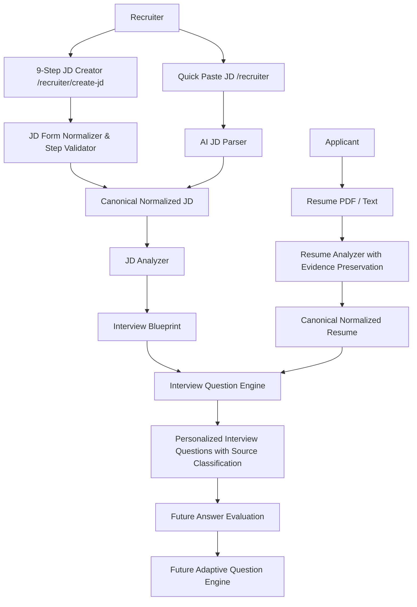

# AI Analysis Architecture & Intelligence Pipeline Specification

## 1. High-Level Architecture

The AI Interview Platform separates recruitment requirement ingestion, candidate resume evidence extraction, and question synthesis into decoupled, modular intelligence engines.



---

## 2. Directory Layout (`backend/src/ai`)

```text
src/ai/
├── core/
│   ├── ai-client.ts         # Resilient LLM wrapper, JSON sanitization, temperature/retries
│   ├── structured-output.ts # Zod schema validation & error formatting
│   └── prompt-runner.ts     # Standardized execution of structured prompts
├── jd/
│   ├── jd-schema.ts         # Zod schemas for Canonical Normalized JD & Interview Blueprint
│   ├── jd-prompts.ts        # System prompts and extraction rules for Quick-Paste & Blueprint
│   ├── jd-normalizer.ts     # Deterministic form normalizer preserving recruiter choices
│   ├── jd-parser.ts         # AI JD Parser extracting raw text to canonical schema
│   └── jd-analyzer.ts       # Derives test areas and interview blueprint
├── resume/
│   ├── resume-schema.ts     # Zod schemas for Canonical Normalized Resume with evidence
│   ├── resume-prompts.ts    # Prompts enforcing strict evidence extraction & no hallucinations
│   ├── resume-parser.ts     # PDF buffer text extractor & regex extraction
│   └── resume-analyzer.ts   # Produces normalized resume with verbatim quotes
├── interview/
│   ├── question-schema.ts   # Schemas for personalized questions & source tags
│   ├── question-prompts.ts  # Prompts combining JD requirements and resume evidence
│   └── question-engine.ts   # Core engine matching JD + Resume -> personalized questions
└── evaluation/
    ├── evaluation-schema.ts # Forward-compatible evaluation schemas
    └── evaluation-prompts.ts # Prompts for future scoring and adaptive loop
```

---

## 3. Structured Prompting Framework

Every AI operation adheres to a strict 5-stage contract implemented via `PromptRunner.execute()`:

1. **System Instructions**: Defines persona and objective.
2. **Structured Input**: Strongly typed payload sanitized of prompt-injection vectors.
3. **Explicit Rules**: Numbered, unambiguous behavioral constraints.
4. **Output Schema Specification**: Concrete JSON schema definition.
5. **Runtime Schema Validation**: Zod runtime validation with fallback generation if parsing fails.

---

## 4. AI Cost Optimization & Caching Pipeline

To eliminate redundant LLM API calls:
- **Content Hashing**: A SHA-256 checksum is computed on the raw input content (JD text or Resume text).
- **Cache Reuse**: If a recruiter updates an unrelated field or re-queries an identical JD, the stored `normalizedJD` and `interviewBlueprint` are served immediately.
- **Cache Invalidation**: Modifying requirements or re-uploading a revised resume triggers a hash mismatch, automatically generating a fresh analysis version (`analysisVersion: "v2"`).
