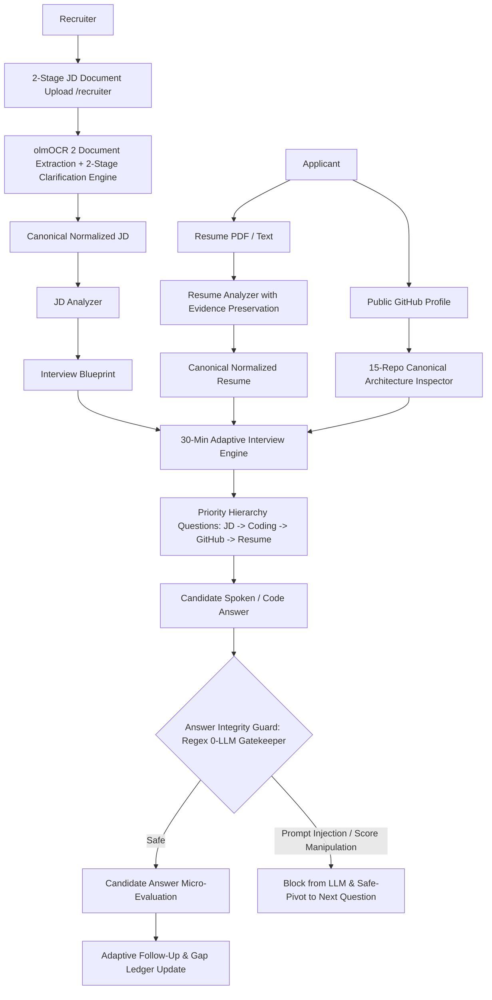

# AI Analysis Architecture & Intelligence Pipeline Specification

## 1. High-Level Architecture

The AI Interview Platform separates recruitment requirement ingestion, candidate resume evidence extraction, and question synthesis into decoupled, modular intelligence engines.



---

## 2. Directory Layout (`backend/src/ai`)

```text
src/ai/
├── core/
│   ├── ai-client.ts         # Resilient LLM wrapper, dynamic model configuration, JSON sanitization
│   ├── structured-output.ts # Zod schema validation & error formatting
│   └── prompt-runner.ts     # Standardized execution of structured prompts
├── jd/
│   ├── jd-schema.ts         # Zod schemas for Canonical Normalized JD & Interview Blueprint
│   ├── jd-prompts.ts        # System prompts and extraction rules for Document Upload & Blueprint
│   ├── jd-parser.ts         # AI JD Parser extracting document Markdown to canonical schema
│   └── jd-analyzer.ts       # Derives test areas and interview blueprint
├── resume/
│   ├── resume-schema.ts     # Zod schemas for Canonical Normalized Resume with evidence
│   ├── resume-prompts.ts    # Prompts enforcing strict evidence extraction & no hallucinations
│   ├── resume-parser.ts     # PDF buffer text extractor & regex extraction
│   └── resume-analyzer.ts   # Produces normalized resume with verbatim quotes
├── interview/
│   ├── question-schema.ts   # Schemas for personalized questions & source tags
│   ├── question-prompts.ts  # Prompts combining JD requirements and resume evidence
│   └── question-engine.ts   # Core engine matching JD + Resume -> personalized questions
├── evaluation/
│   ├── evaluation-schema.ts # Candidate answer micro-evaluations (clarity, warmth, fluency, etc.)
│   └── evaluation-prompts.ts # Prompts for dynamic scoring and adaptive follow-ups
└── evidence/
    ├── evidence-types.ts    # Zod schemas for Graph, Gap Ledger, Claims, Neutral Contradictions, GitHub Analysis
    ├── evidence-graph.ts    # Node/Edge Provenance Graph builder (JD -> Resume -> GitHub -> Question -> Answer -> Evaluation)
    ├── evidence-gap-engine.ts # Calculates gap resolution state (VERIFIED, PARTIALLY_VERIFIED, UNVERIFIED, NO_EVIDENCE)
    ├── github-analyzer.ts   # Static public GitHub profile inspector with prompt-injection defense
    ├── resume-claim-verifier.ts # Extracts measurable claims from resume & tracks verification
    ├── contradiction-detector.ts # Detects discrepancies with neutral terminology & human review flags
    ├── ai-fluency-evaluator.ts # Evaluates AI verification discipline & copilot code debugging
    ├── question-guardrails.ts # Deterministic 8-point question validator
    ├── proctoring-correlation-engine.ts # Multi-signal proctoring audit, telemetry, and keystroke correlation
    ├── answer-integrity-guard.ts # Local regex answer integrity guard (zero LLM, zero external API)
    ├── evidence-profile-builder.ts # Generates explainable report, cohort percentiles, difficulty normalization
    └── adaptive-interview-engine.ts # Dynamic interview engine enforcing priority queue & non-redundant grilling
```

---

## 3. Structured Prompting Framework

Every AI operation adheres to a strict 5-stage contract implemented via `PromptRunner.execute()`:

1. **System Instructions**: Defines persona and objective.
2. **Structured Input**: Strongly typed payload sanitized of prompt-injection vectors.
3. **Explicit Rules**: Numbered, unambiguous behavioral constraints.
4. **Output Schema Specification**: Concrete JSON schema definition.
5. **Runtime Schema Validation**: Zod runtime validation with fallback generation if parsing fails.

---

## 4. 2-Stage JD Document Upload & Clarification Pipeline

1. **Stage 1 (`/recruiter/jd/upload-stage1`)**:
   - `olmOCR 2` extracts document text into Markdown.
   - OpenAI Call 1 parses raw text into initial structured JSON and generates clarification questions for ambiguities.
   - Regex matches and renumbers questions `1..N`. If `questionCount === 0`, status set directly to `COMPLETED`.
2. **Stage 2 (`/recruiter/jd/stage2-finalize`)**:
   - Frontend collects candidate/recruiter answers in a single step input form.
   - OpenAI Call 2 merges answers into the `Final Structured JD`.

---

## 5. AI Cost Optimization & Caching Pipeline

To eliminate redundant LLM API calls:
- **Content Hashing**: A SHA-256 checksum is computed on the raw input content (uploaded JD document text or Resume text).
- **Cache Reuse**: If a recruiter re-queries an identical JD document, the stored `normalizedJD` and `interviewBlueprint` are served immediately.
- **Cache Invalidation**: Re-uploading a revised document or resume triggers a hash mismatch, automatically generating a fresh analysis version (`analysisVersion: "v2"`).

---

## 6. Dynamic Model Configuration (`OPENAI_MODEL`)

The platform supports pluggable LLM models via the `OPENAI_MODEL` environment variable in `backend/.env`:

```dotenv
# Recommended production default (cost & speed optimized):
OPENAI_MODEL="gpt-4o-mini"

# Full reasoning model (for deep research evaluation):
# OPENAI_MODEL="gpt-4o"
```

All core AI services (`AIClient`, `OpenAIService`, `PromptRunner`) ingest `env.OPENAI_MODEL` dynamically. This enables downgrading the model to `gpt-4o-mini` with zero code modifications while cutting operational token costs by up to **96%**.

---

## 7. Token Estimation & Unit Economics per Interview

A standard candidate interview consists of:
- 1 Initial greeting and role framing question
- 5–8 Adaptive technical competency probes
- 1–2 Live coding challenge evaluations
- 1 Final comprehensive Candidate Evidence Profile & Evaluation report synthesis

### Token Breakdown per Phase

| Interview Phase | Input Tokens (Prompt + History) | Output Tokens (Response) | Calls per Session | Total Tokens |
| :--- | :--- | :--- | :--- | :--- |
| **Initial Question Generation** | ~1,200 | ~350 | 1 | ~1,550 |
| **Answer Evaluation & Follow-Up Probes** | ~1,800 | ~400 | 6–8 | ~14,000 |
| **Live Coding Challenge Generation & Eval** | ~1,500 | ~500 | 1–2 | ~3,000 |
| **Final Evidence Profile Synthesis** | ~2,500 | ~1,200 | 1 | ~3,700 |
| **Total per Interview Session** | **~18,000** | **~4,200** | **~10 calls** | **~22,200 tokens** |

### Cost Comparison per 1 Completed Interview

| Model | Input Token Rate | Output Token Rate | Cost per Interview | Cost for 1,000 Interviews |
| :--- | :--- | :--- | :--- | :--- |
| **`gpt-4o`** | \$2.50 / 1M | \$10.00 / 1M | **~\$0.087** | \$87.00 |
| **`gpt-4o-mini`** | **\$0.15 / 1M** | **\$0.60 / 1M** | **~\$0.0052** | **\$5.22** |

> [!TIP]
> Switching from `gpt-4o` to `gpt-4o-mini` reduces the cost of conducting **1,000 full-length candidate interviews from \$87 down to just \$5.22** with identical schema adherence and evaluation accuracy.

---

## 8. Speech Synthesis & Audio Pipeline Economics

### Whisper Usage
- The platform does **not** rely on paid OpenAI Whisper API endpoints for routine interview flow.
- Audio transcription uses local browser Web Speech recognition or self-hosted ONNX inference, eliminating external speech-to-text API charges.

### Kokoro TTS Local Synthesis
- Text-to-speech is powered by **Kokoro-82M** running locally in the browser/backend:
  - Generates human-like, high-fidelity audio in under $300\text{ms}$.
  - Operates completely offline with **zero per-character or per-minute API costs**.
  - Replaces paid cloud TTS services (such as ElevenLabs at \$0.30/1,000 characters), saving an additional **~\$0.90–\$1.50 per interview**.
