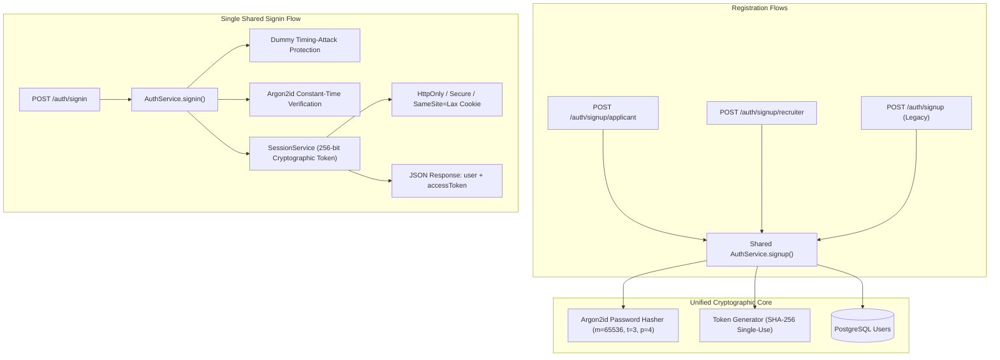

# Authentication Architecture & Role-Based Access Specification

## 1. Overview

The AI Interview Platform implements a centralized, production-grade native authentication architecture. It provides role-specific registration paths for **Applicants** and **Recruiters** while strictly routing all sign-in attempts through a single, unified authentication pipeline.



---

## 2. API Endpoints

### 2.1 Applicant Signup
- **Endpoint**: `POST /api/v1/auth/signup/applicant`
- **Rate Limit**: 5 requests per 15 minutes
- **Request Body**:
  ```json
  {
    "email": "applicant@example.com",
    "password": "StrongPassword123!",
    "name": "Jane Doe"
  }
  ```
- **Response**: `201 Created`
  ```json
  {
    "success": true,
    "message": "Registration successful. A verification email has been sent to your address.",
    "user": {
      "id": "c1f7a0c8-4720-4e50-9d0a-e45f949c5123",
      "email": "applicant@example.com",
      "name": "Jane Doe",
      "role": "APPLICANT",
      "emailVerified": false,
      "createdAt": "2026-09-03T02:50:00.000Z"
    }
  }
  ```

### 2.2 Recruiter Signup
- **Endpoint**: `POST /api/v1/auth/signup/recruiter`
- **Rate Limit**: 5 requests per 15 minutes
- **Request Body**:
  ```json
  {
    "email": "recruiter@techcorp.com",
    "password": "StrongPassword123!",
    "name": "Alex Smith"
  }
  ```
- **Response**: `201 Created`
  ```json
  {
    "success": true,
    "message": "Registration successful. A verification email has been sent to your address.",
    "user": {
      "id": "b8a91c20-7210-4f51-8a9b-d72b849c9981",
      "email": "recruiter@techcorp.com",
      "name": "Alex Smith",
      "role": "RECRUITER",
      "emailVerified": false,
      "createdAt": "2026-09-03T02:50:00.000Z"
    }
  }
  ```

### 2.3 Single Unified Signin
- **Endpoint**: `POST /api/v1/auth/signin`
- **Rate Limit**: 10 requests per 15 minutes
- **Description**: Authenticates both Applicants and Recruiters through a single shared endpoint. The role is determined dynamically after credentials are verified.
- **Request Body**:
  ```json
  {
    "email": "recruiter@techcorp.com",
    "password": "StrongPassword123!"
  }
  ```
- **Response**: `200 OK`
  ```json
  {
    "success": true,
    "message": "Signed in successfully",
    "user": {
      "id": "b8a91c20-7210-4f51-8a9b-d72b849c9981",
      "email": "recruiter@techcorp.com",
      "name": "Alex Smith",
      "role": "RECRUITER",
      "emailVerified": false,
      "createdAt": "2026-09-03T02:50:00.000Z",
      "updatedAt": "2026-09-03T02:50:00.000Z"
    },
    "accessToken": "3f90e8a71b4c92...",
    "data": {
      "user": {
        "id": "b8a91c20-7210-4f51-8a9b-d72b849c9981",
        "email": "recruiter@techcorp.com",
        "name": "Alex Smith",
        "role": "RECRUITER",
        "emailVerified": false
      },
      "accessToken": "3f90e8a71b4c92..."
    }
  }
  ```
- **Cookie Set**: `Set-Cookie: ai_interview_session=<token>; HttpOnly; Secure; SameSite=Lax; Path=/; Max-Age=604800`

---

## 3. Security Non-Duplication Guarantees

Under the hood, all auth operations share zero-duplicate implementations:
1. **Password Hashing**: Centralized in `src/utils/password.ts` using OWASP-compliant Argon2id (`m=65536, t=3, p=4`).
2. **Timing-Attack Resistance**: When a non-existent email is queried during signin, a deterministic dummy Argon2 verification runs to ensure consistent response timing.
3. **Session Management**: Centralized in `SessionService.ts`. Secure 256-bit random tokens are hashed with SHA-256 before being stored in the database.
4. **Token Generation**: Centralized in `src/utils/token.ts` utilizing cryptographically secure pseudorandom number generators (`crypto.randomBytes`).
5. **Authorization Middleware**: Centralized in `src/middlewares/requireAuth.ts` supporting both session cookies and Authorization bearer tokens.
