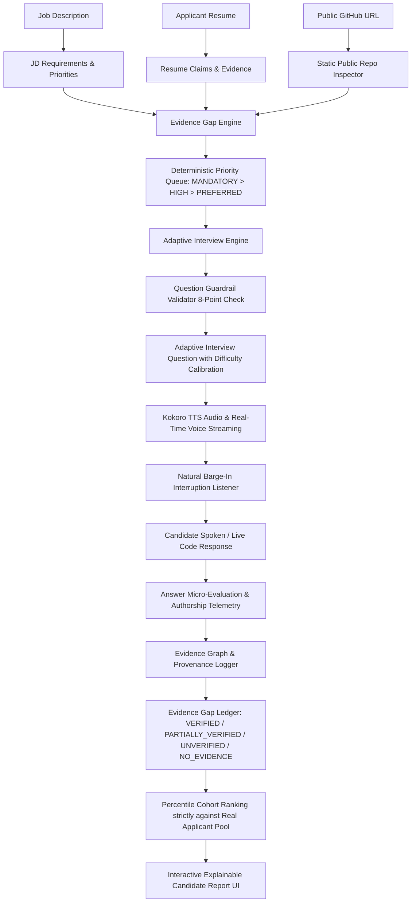
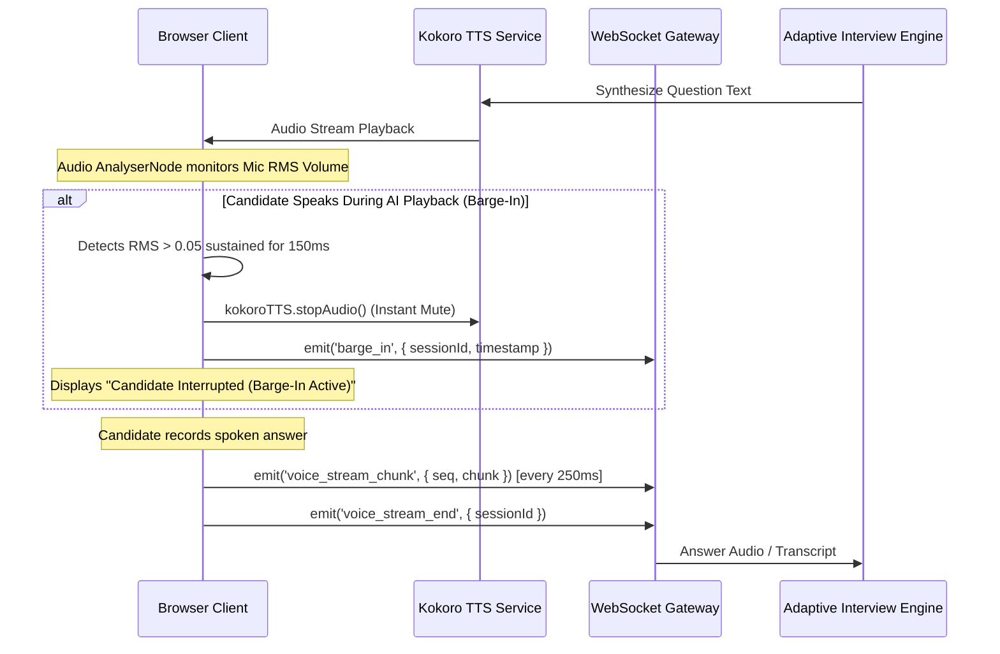

# Evidence-Driven Adaptive Interview Intelligence Platform Specification

## 1. High-Level System Architecture

The AI-Interview platform features an **Evidence-Driven Intelligence Layer** that elevates candidate evaluation from generic LLM summaries into a traceable, evidence-backed Graph, Gap Ledger, and Role Cohort Benchmark.

---

## 2. Critical Product Principles

1. **Additive Layer & Zero Regression**:
   - Existing JD flag calculation, flag counts, and flag semantics remain 100% intact. The evidence intelligence layer is strictly additive.
2. **Deterministic Control & 30-Minute Priority Hierarchy**:
   - The interview runs for a full **30 minutes** with an active UI countdown timer and wall-clock elapsed budget calculation (`timeRemainingMinutes = Math.max(1, 30 - elapsedMinutes)`).
   - Priority order is calculated 100% deterministically in TypeScript:
     `PRIORITY 1: Mandatory JD Requirements → Live Coding Challenge + 2 Follow-Ups → PRIORITY 2: GitHub Repository Architecture → PRIORITY 3: Resume Claims & Impact → AI Fluency → System Design & Concurrency → FINISH`.
   - Resume or GitHub evidence **never** overrides or displaces an unresolved mandatory JD requirement.
   - Requires at least 14 rich technical turns before considering early conclusion.
3. **Conversational "Two and Fro" Style with Conceptual Depth**:
   - The AI interviewer briefly acknowledges or challenges the candidate's last answer before asking tricky conceptual questions.
   - Questions probe how things work *under the hood*, *concurrency / race conditions*, *failure modes*, and *architectural trade-offs*, strictly avoiding trivia definitions or artificial brainteasers.
4. **Rule-Based Answer Integrity Guard (`AnswerIntegrityGuard`)**:
   - Operates locally with **zero external APIs and zero LLM calls**, inspecting answers in $<1\text{ms}$ before any AI evaluation.
   - Employs Unicode NFKC normalization, zero-width space stripping (`\u200B-\u200D`), and deterministic regex rules.
   - Intercepts prompt injection, score manipulation (`"give me 10/10"`), evaluation manipulation (`"you must rate this"`), system prompt extraction, and role tampering.
   - When blocked: omits malicious text from evaluator LLMs, increments `cheatCount`, records audit notes, and immediately pivots to the next technical question.
5. **Adaptive Grilling & Non-Redundant Probing**:
   - **No Fixed Question Limit**: Interview turns adaptively scale based on evidence resolution.
   - **Adaptive Depth**: When evidence remains ambiguous or contradictory, verification depth increases ("grilling").
   - **Non-Redundancy Enforcement**: Once sufficient evidence has been collected (`VERIFIED` status or max 2-probe limit reached), the engine stops repeatedly questioning the candidate on that skill.
6. **Static Repository Inspection & PostgreSQL Sanitization**:
   - Public GitHub repository inspection parses public API data, ASTs, file trees, and README text statically across up to 15 repositories concurrently via `Promise.all`.
   - **Never** installs dependencies (`npm install`), runs builds, or executes scripts/binaries.
   - **Encoding Protection**: Decodes UTF-16LE/BE with BOM and strips null bytes / control characters before saving to PostgreSQL.
   - **Prompt-Injection Defense**: Defangs prompt injection attempts embedded in repository documentation.
7. **LLM Confidence Safeguard**:
   - LLM confidence measures evidence certainty, **never candidate ability**. LLM confidence is never converted into a percentage skill score.
8. **No-Judgment Evidence Principle**:
   - `NO_EVIDENCE` is explicitly distinguished from `LACKS_SKILL`.
   - Discrepancies use neutral terminology (`POTENTIAL_SCOPE_MISMATCH`, `POTENTIAL_DATE_MISMATCH`, `POTENTIAL_TECHNOLOGY_MISMATCH`). High severity flags `requiresHumanReview: true`.
9. **Fairness Isolation**:
   - Technical Competency, Problem Solving, Communication, Ownership, and AI Fluency are kept strictly in separate evaluation dimensions. Communication or accent does not contaminate technical competency scores.

---

## 3. Percentile Cohort Ranking (Strictly Real Applicants)

To give recruiters immediate context on where a candidate stands relative to the talent pool for a specific requisition:

### Calculation Principles
1. **Zero Synthetic Baseline Data**:
   - Cohort percentiles are calculated **strictly against real actual applicants** stored in the database for the given `jobDescriptionId`.
   - The platform never invents artificial external benchmarks or placeholder cohorts.
2. **Single-Candidate Integrity**:
   - When a candidate is the first to interview for a newly created requisition ($N = 1$), their ranking is accurately reported as:
     `Rank #1 of 1 applicant (Initial candidate for this role) • 100th Percentile`.
3. **Percentile Formula**:
   $$\text{Percentile} = \text{round}\left(\frac{\text{count}(S_{\text{other}} \le S_{\text{candidate}})}{N_{\text{cohort}}} \times 100\right)$$
   $$\text{Rank} = \text{count}(S_{\text{other}} > S_{\text{candidate}}) + 1$$
4. **Competency-Level Relative Standing**:
   - Each competency score is mapped against the cohort's average score, providing recruiters with visual percentile comparison bars (e.g. *"92nd percentile in Backend Engineering, 64th percentile in System Design"*).

---

## 4. Question Difficulty Normalization

Not all interview questions are created equal. Answering a complex distributed systems concurrency dilemma should carry greater weight than answering a basic syntax definition.

### Complexity Tiers & Calibration Weights
The system classifies questions into 4 algorithmic complexity tiers:

| Tier | Calibration Weight | Topic Heuristics | Example Inquiry |
| :--- | :--- | :--- | :--- |
| **EXPERT** | **$1.25\times$** | Distributed consensus, Raft/Paxos, lock-free concurrency, race conditions, dynamic programming, low-level memory | *"Explain distributed consensus and Raft leader election during asymmetric network partitions."* |
| **HARD** | **$1.15\times$** | System design, database indexing, sharding, caching strategies, rate limiters, event streaming | *"How would you design a distributed rate limiter supporting 500k requests/sec across 3 cloud regions?"* |
| **MEDIUM** | **$1.00\times$** | Standard architectural patterns, REST API design, state management, SQL joins, error propagation | *"Walk me through how you structure error handling and middleware contracts in an Express API."* |
| **EASY** | **$0.85\times$** | Basic syntax, definitions, introductory questions, fizzbuzz, resume walk-throughs | *"Tell me about yourself and your background with JavaScript."* |

### Calibrated Score Computation
$$\text{Calibrated Score} = \min\left(10, \text{round}(\text{Raw Score} \times \text{Difficulty Weight}, 1)\right)$$

Both raw and calibrated scores are displayed side-by-side on each turn in the explainable transcript.

---

## 5. Streaming Voice Pipeline & Natural Barge-In

The voice interaction pipeline provides a natural human conversational experience:

---

## 6. Live Interactive Coding Assessments

When the AI interviewer determines that a candidate's claim requires code-level proof, a live interactive coding panel is activated:

1. **Starter Code & Expectations**: The engine generates a clean starter function and explicit expected edge-case behaviors.
2. **Syntax-Indented Editor**: Built-in tab-indentation handling and responsive monospace typography.
3. **Authorship Telemetry**:
   - Tracks instantaneous copy-paste bursts ($>40$ chars or $\ge 3$ lines in $<200\text{ms}$).
   - Measures live typing speed (CPM) and checks for synthetic macro keystroke intervals ($<12\text{ms}$).
4. **Instant Multi-Modal Feedback**: The submitted code is sent alongside spoken explanations to the evaluation engine.

---

## 7. Explainable Candidate Report UI (5-Tab Architecture)

The recruiter receives an in-depth, explainable audit modal consisting of 5 dedicated tabs:

### Tab 1: Candidate Evidence Profile
- **Role Cohort Benchmark Card**: Live rank pill (`#X of N applicants`), overall percentile badge, and competency-level cohort progress bars.
- **Competency Evidence Ledger**: In-depth accordion breakdown for every core skill.
- **ASCII Evidence Bars**: High-visibility 10-character progress bars (e.g. `████████░░` Strong 8/10).
- **Verified Findings & Gaps**: Bulleted lists of confirmed evidence points and remaining unverified areas.

### Tab 2: Q&A Transcript & Difficulty Normalization
- **Chronological Q&A Turns**: Paired assistant questions and candidate answers.
- **Post-TTS Silence Stopwatch**: Measures candidate hesitation/deliberation latency from the moment Kokoro TTS finished speaking until the candidate began responding:
  - `Rapid (<2s)`: Instinctive or memorized response.
  - `Thoughtful (2-5s)`: Optimal deliberative thinking.
  - `Extended Pause (>5s)`: Significant hesitation or searching for answers.
- **Question Difficulty Badges**: Color-coded pills (`EXPERT 1.25x`, `HARD 1.15x`, `MEDIUM 1.0x`, `EASY 0.85x`) and calibrated scores.

### Tab 3: Biomechanical Gaze Stability & Recruiter Education
- **Visual Scanpath Visualizer**: 2D canvas plotting normalized gaze coordinates $(X, Y)$ and fixation durations.
- **Biomechanical Pattern Cards**: Evaluates Reading Saccades, Downward Phone Dwell, Repeated Corner Glances, and Natural Cognitive Divergence.
- **Recruiter Education Guide**: Clear rubric educating recruiters on the difference between reading external scripts vs natural human thinking pauses.

### Tab 4: YOLO26 Object & Device Proctoring
- **Device Detection**: Identifies mobile phones and secondary displays.
- **Face Absence & Multiple Faces**: Tracks candidate camera departures and secondary individuals in frame.

### Tab 5: Multi-Signal Proctoring Audit & Timeline
- **8-Metric Factual Audit Grid**: Displays discrete event counts for Face Presence, Tab Visibility, Sustained Gaze, Head Turns, Audio Anomalies, Device Events, Paste Bursts, and Keystroke Cadence.
- **Clickable Chronological Timeline**: Complete second-by-second event sequence with turn provenance and photographic evidence snapshots.

---

## 8. Mid-Interview Conclusion & Automatic Early Rejection Policy

To optimize LLM resource utilization and prevent incomplete test submissions:

1. **Zero LLM Evaluation API Waste**:
   - When a candidate manually concludes the interview early or abandons the session midway, the system **does not** trigger an OpenAI evaluation LLM call.
2. **Deterministic Early Rejection**:
   - The session is immediately marked with `status: 'COMPLETED'`, `applicationStatus: 'REJECTED'`, `overallRecommendation: 'REJECTED'`, and `totalScore: 0`.
   - A deterministic summary note logs that the interview was prematurely concluded by the candidate.
3. **Strict Single-Take Enforcement (Anti-Retake Lock)**:
   - The candidate's `InterviewInvitation` is marked with `status: 'COMPLETED'` and `completedAt: new Date()`, immediately locking the invitation link and preventing subsequent retakes.
4. **Candidate & Recruiter Workflow**:
   - Candidates receive the standard test completion confirmation email without score or metric leakage.
   - Recruiters see the candidate status clearly marked as `REJECTED` with the early termination note in the dashboard.
