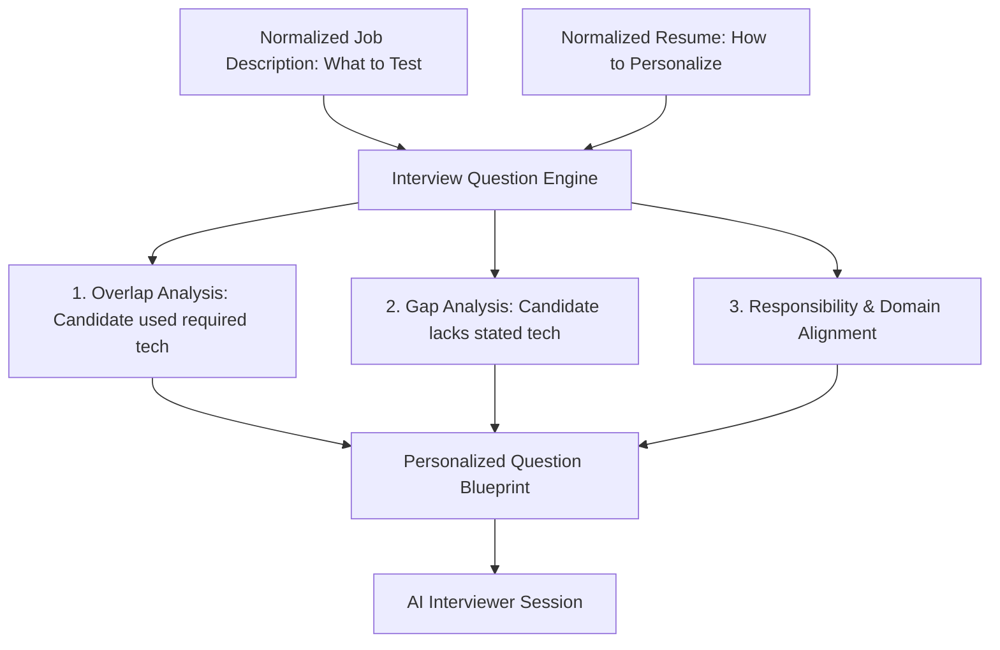

# Interview Question Engine & Personalized Question Synthesis Specification

## 1. Core Principle: Synthesis of Two Intelligence Sources

The core philosophy of the Interview Question Engine is:
- **The Recruiter Job Description determines WHAT MUST BE TESTED.**
- **The Applicant Resume determines HOW THE QUESTION IS PERSONALIZED.**

Generic questions (such as *"Explain what Redis is"* or *"What is PostgreSQL?"*) are strictly prohibited. Every question must be anchored in the candidate's actual projects, architecture, and employment history while rigorously testing the recruiter's explicit requirements.



---

## 2. Question Source Classification

Every generated question includes source metadata for explainability and auditability:

| Source Tag | Description | Example Trigger |
|---|---|---|
| `JD_REQUIREMENT` | Directly assesses a required skill from the JD | JD requires Node.js and PostgreSQL |
| `JD_RESPONSIBILITY` | Directly assesses a core duty from the JD | JD responsibility: "Design and maintain high-scale APIs" |
| `JD_DOMAIN` | Probes industry or sector context | JD requires FinTech / Payments experience |
| `RESUME_SKILL` | Anchors onto a technical skill listed in the resume | Candidate listed Redis in skills |
| `RESUME_PROJECT` | Anchors directly onto a specific project in the resume | Candidate built an E-Commerce backend |
| `RESUME_EXPERIENCE` | Anchors onto past employment accomplishments | Candidate optimized queries at CloudScale Systems |
| `JD_RESUME_OVERLAP` | Both JD requires it and candidate has worked with it | JD requires Redis, resume implemented Redis caching |
| `JD_GAP` | JD requires it, but resume contains no direct evidence | JD requires System Design, candidate has no design listed |
| `BEHAVIORAL` | Evaluates recruiter-specified soft skills / traits | Evaluates "Ownership" or "Problem Solving" |
| `FOLLOW_UP` | Adaptive probe challenging a previous response | Probe generated based on a vague candidate answer |

---

## 3. Real-World Synthesis Example

### Recruiter JD
```text
Role: Senior Backend Engineer
Required: PostgreSQL, Redis, System Design
Responsibility: Architect resilient payment APIs
```

### Applicant Resume Evidence
```text
Project: Built an e-commerce backend platform.
Evidence: Used PostgreSQL for order transactions; used Redis for product data caching.
```

### Generated Personalized Questions

#### Question 1: Overlap Deep Dive
> *"In your e-commerce project, you mentioned using PostgreSQL for order management. How did you structure the relational schema and handle ACID transactions under concurrent checkout attempts?"*
- **Skill**: PostgreSQL
- **Difficulty**: MEDIUM
- **Sources**: `["JD_REQUIREMENT", "RESUME_PROJECT", "JD_RESUME_OVERLAP"]`
- **Rationale**: PostgreSQL is a mandatory JD requirement, and the applicant documented hands-on database usage in their e-commerce backend project.

#### Question 2: Invalidation & Concurrency
> *"You noted implementing Redis caching for product catalog data. What specific caching pattern did you use, and how did you prevent stale reads and cache stampedes when inventory changed?"*
- **Skill**: Redis
- **Difficulty**: MEDIUM
- **Sources**: `["JD_REQUIREMENT", "RESUME_PROJECT", "JD_RESUME_OVERLAP"]`
- **Rationale**: Redis is required by the JD and substantiated by the candidate's project evidence.

#### Question 3: System Design & Scaling
> *"The Senior Backend Engineer role requires designing scalable, fault-tolerant architectures. How would you redesign the e-commerce ordering engine you built to support a 10x surge in transaction volume without compromising consistency?"*
- **Skill**: System Design & Architecture
- **Difficulty**: HARD
- **Sources**: `["JD_REQUIREMENT", "JD_RESPONSIBILITY", "RESUME_PROJECT"]`
- **Rationale**: Connects the JD's primary architectural responsibility to the applicant's existing system design background.

---

## 4. Adaptive Interviewing Foundation

The engine provides `QuestionEngine.generateFollowUpQuestion()`. When a candidate's answer is evaluated during the live interview:

```text
Question Asked
      ↓
Candidate Answer
      ↓
Micro-Evaluation (Clarity, Warmth, Depth)
      ↓
Identified Weak Area or Ambiguity
      ↓
Adaptive Follow-Up Probe ("FOLLOW_UP")
```

This ensures the foundation is ready for turn-by-turn conversational adaptation without requiring changes to the core schemas.
