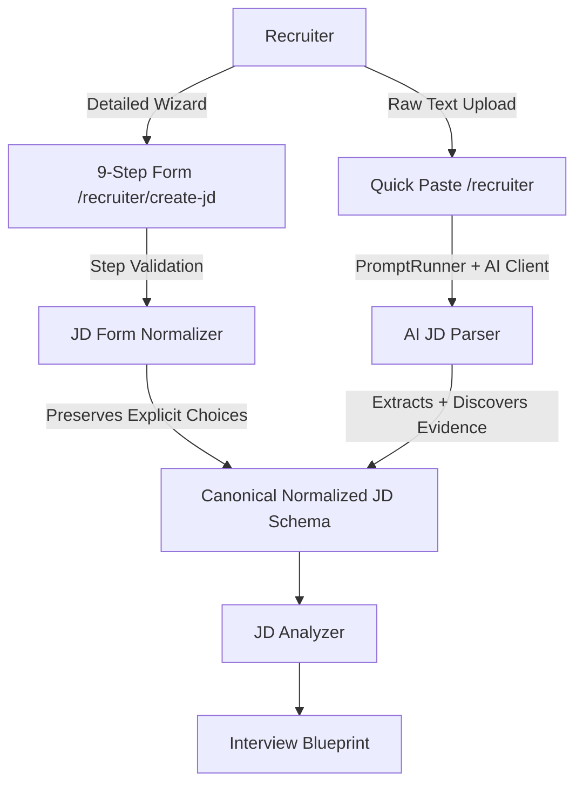

# Recruiter Job Description Intelligence & Canonical Normalization Specification

## 1. Executive Summary

The recruiter portal provides two distinct workflows for authoring Job Descriptions:
1. **9-Step Comprehensive Job Creator** (Route: `/recruiter/create-jd`)
2. **Quick-Paste JD** (Accessible from `/recruiter`)

Both pipelines converge into the **same Canonical Normalized Job Description Schema**. This normalized representation is subsequently consumed by the **JD Analyzer** (to generate an **Interview Blueprint**) and the **Interview Question Engine**.



---

## 2. The Existing Recruiter 9-Step Comprehensive Form

The 9-step recruiter wizard (`/recruiter/create-jd`) gathers structured, intentional recruitment requirements:

| Step | Section Name | Form Fields | Normalization Mapping | Source Tag |
|---|---|---|---|---|
| **1** | **Job Basics** | Job Title, Department, Job Level, Employment Type, Openings, Work Mode, Location, Joining Date | `job.title`, `job.department`, `job.level`, `job.employmentType`, `job.openings`, `job.workMode`, `job.location`, `job.joiningDate` | `{ type: "RECRUITER_FORM", step: 1 }` |
| **2** | **Job Details** | Short Summary, Full Detailed Description, Hiring Reason | `role.summary`, `role.description`, `role.hiringReason` | `{ type: "RECRUITER_FORM", step: 2 }` |
| **3** | **Responsibilities** | Dynamic Core Responsibilities list, Typical Day-to-Day Work | `responsibilities[]` with `priority` (MANDATORY/HIGH/MEDIUM) | `{ type: "RECRUITER_FORM", step: 3 }` |
| **4** | **Required Skills** | Skill Name, Importance (Must Have), Proficiency (Beginner, Intermediate, Advanced, Expert) | `requiredSkills[]` (Category classified, importance = MUST_HAVE) | `{ type: "RECRUITER_FORM", step: 4 }` |
| **5** | **Experience** | Min/Max Experience, Industry Experience, Freshers Allowed, Fresher Requirements | `experience.minimumYears`, `experience.maximumYears`, `experience.freshersAllowed`, `experience.industryExperience` | `{ type: "RECRUITER_FORM", step: 5 }` |
| **6** | **Education** | Minimum Education, Degree/Major, CGPA Threshold, Certifications | `education.minimumLevel`, `education.degrees`, `education.minimumCGPA`, `education.certifications` | `{ type: "RECRUITER_FORM", step: 6 }` |
| **7** | **Preferred Skills** | Nice-to-have Skills, Bonus Industry Experience, Other Preferred Skills | `preferredSkills[]` (importance = PREFERRED) | `{ type: "RECRUITER_FORM", step: 7 }` |
| **8** | **Candidate Qualities** | Behavioral Qualities, Required Languages, Shift/Relocation Constraints | `candidateQualities.behavioral`, `candidateQualities.languages`, `logistics.shiftRequirements` | `{ type: "RECRUITER_FORM", step: 8 }` |
| **9** | **Final Review** | AI Summary Preview, Save Draft, Publish | Validation against `CanonicalNormalizedJDSchema` | `{ type: "RECRUITER_FORM", step: 9 }` |

### Critical Rule: Preserving Explicit Recruiter Selections
When a recruiter specifies:
- Skill: `Node.js`
- Importance: `Must Have`
- Proficiency: `Advanced`

The backend **does not** ask an LLM whether Node.js is required or what proficiency is expected. The explicit recruiter selection is 100% preserved. The normalizer only enriches the technical category (`category: "BACKEND"`) and assigns the requirement source.

---

## 3. The Quick-Paste JD Flow

In the Quick-Paste flow (`/recruiter`), recruiters provide:
- `Job Title`
- `Full Raw JD Text`

The backend passes this text through the **AI JD Parser** (`JDParser.parseQuickPasteJD`), which extracts all parameters into the exact same canonical schema:
- Separates **MANDATORY** skills (`requiredSkills`) from **PREFERRED** skills (`preferredSkills`).
- Extracts numerical experience bounds (`minExperience`, `maxExperience`).
- Extracts education thresholds and degree requirements.
- Distinguishes responsibilities from skills.
- Assigns `{ type: "QUICK_PASTE", textEvidence: "..." }` to every extracted entity.
- Strictly adheres to the rule: **Never invent or hallucinate requirements not present in the pasted text**.

---

## 4. Semantic Importance Hierarchy

The AI platform recognizes 4 distinct semantic tiers:
1. `MANDATORY` / `MUST_HAVE`: Hard technical or experiential prerequisites (e.g. Node.js, PostgreSQL). Non-negotiable during interview evaluation.
2. `PREFERRED` / `GOOD_TO_HAVE`: Nice-to-have skills that provide bonus evaluation scoring (e.g. Docker, Redis).
3. `OPTIONAL`: Technologies mentioned as incidental or exploratory.
4. `INFORMATIONAL` / `LOGISTICAL`: Non-technical constraints such as location, work mode, and joining dates.

---

## 5. Canonical Normalized JD Schema

```json
{
  "job": {
    "title": "Senior Backend Engineer",
    "department": "Engineering",
    "level": "SENIOR",
    "employmentType": "FULL_TIME",
    "openings": 2,
    "workMode": "HYBRID",
    "location": "Bangalore",
    "joiningDate": "2026-10-01"
  },
  "role": {
    "summary": "Design and lead high-scale microservices",
    "description": "Full detailed description...",
    "hiringReason": "NEW_POSITION"
  },
  "responsibilities": [
    {
      "description": "Design and develop scalable backend APIs",
      "priority": "MANDATORY",
      "source": { "type": "RECRUITER_FORM", "step": 3, "textEvidence": "Design and develop scalable backend APIs" }
    }
  ],
  "requiredSkills": [
    {
      "name": "Node.js",
      "category": "BACKEND",
      "importance": "MUST_HAVE",
      "proficiency": "ADVANCED",
      "source": { "type": "RECRUITER_FORM", "step": 4 }
    },
    {
      "name": "PostgreSQL",
      "category": "DATABASE",
      "importance": "MUST_HAVE",
      "proficiency": "INTERMEDIATE",
      "source": { "type": "RECRUITER_FORM", "step": 4 }
    }
  ],
  "preferredSkills": [
    {
      "name": "Docker",
      "category": "DEVOPS",
      "importance": "PREFERRED",
      "proficiency": "INTERMEDIATE",
      "source": { "type": "RECRUITER_FORM", "step": 7 }
    }
  ],
  "experience": {
    "minimumYears": 3,
    "maximumYears": 7,
    "industryExperience": ["FinTech", "SaaS"],
    "freshersAllowed": false,
    "fresherRequirements": [],
    "source": { "type": "RECRUITER_FORM", "step": 5 }
  },
  "education": {
    "minimumLevel": "BACHELORS",
    "degrees": ["Computer Science"],
    "minimumCGPA": "7.0",
    "certifications": [],
    "source": { "type": "RECRUITER_FORM", "step": 6 }
  },
  "candidateQualities": {
    "behavioral": ["Ownership", "Problem Solving", "Proactive Communication"],
    "languages": ["English"],
    "source": { "type": "RECRUITER_FORM", "step": 8 }
  },
  "logistics": {
    "shiftRequirements": [],
    "relocationRequired": false,
    "workMode": "HYBRID",
    "location": "Bangalore",
    "joiningDate": "2026-10-01",
    "source": { "type": "RECRUITER_FORM", "step": 1 }
  },
  "interviewRequirements": {
    "technical": true,
    "coding": true,
    "systemDesign": true,
    "behavioral": true,
    "domainKnowledge": true,
    "source": { "type": "RECRUITER_FORM", "step": 4 }
  },
  "interviewDimensions": [
    {
      "skill": "Node.js",
      "category": "BACKEND",
      "importance": "MUST_HAVE",
      "testAreas": ["Event loop", "Streams", "API design", "Memory leaks"],
      "sampleProbes": ["How do you troubleshoot process crashes caused by unhandled promise rejections?"]
    }
  ]
}
```

---

## 6. Interview Blueprint Generation

Once normalized, the JD is passed into `JDAnalyzer.generateInterviewBlueprint()`. This derives:
- **Test Areas**: 3-5 technical sub-domains per skill (e.g. PostgreSQL -> Schema Design, Indexing, Transactions, Query Optimization).
- **Sample Scenario Probes**: Concrete architectural situations designed to assess practical competency.
- **Architectural Scope**: Whether live coding, system design, or distributed systems questions must be generated.
