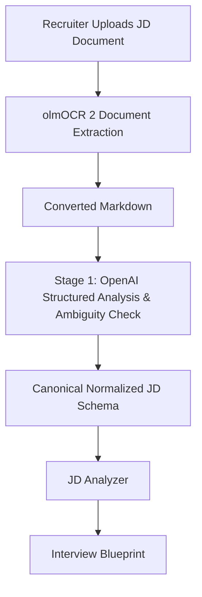
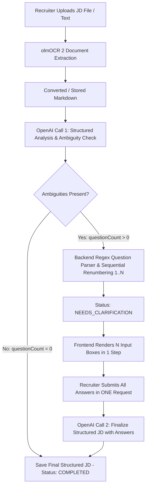

# Recruiter Job Description Intelligence & Canonical Normalization Specification

## 1. Executive Summary

The recruiter portal provides a single, streamlined document processing workflow for authoring Job Descriptions:
**2-Stage JD Document Upload & Clarification Pipeline** (Routes: `POST /api/v1/recruiter/jd/upload-stage1` & `POST /api/v1/recruiter/jd/stage2-finalize`).

Recruiters upload job descriptions as documents (`.pdf`, `.docx`, images, or text files). The pipeline processes the document via `olmOCR 2` document extraction, normalizes requirements into a canonical schema, generates single-step clarification questions if ambiguities exist, and feeds the finalized representation into the **JD Analyzer** (to generate an **Interview Blueprint**) and the **Interview Question Engine**.



---

## 2. 2-Stage JD Analysis & Clarification Pipeline (olmOCR 2 + OpenAI)

### Overview
The 2-Stage JD Analysis pipeline processes uploaded JD documents (`.pdf`, `.docx`, images, text) using `olmOCR 2` document extraction, performs initial structured analysis via OpenAI, and dynamically generates single-step clarification questions if ambiguities exist.



### Stage 1: Document Upload & Initial Analysis
- **Route**: `POST /api/v1/recruiter/jd/upload-stage1`
- **Engine**: `olmOCR 2` (`ResumeParser.extractText`) extracts raw document content directly to Markdown.
- **OpenAI Call 1**: Evaluates Markdown and returns:
  - `structuredJD`: JSON containing `role`, `seniority`, `must_have_skills`, `nice_to_have_skills`, `responsibilities`, `technical_competencies`, `experience_requirements`, `domain_knowledge`, `evaluation_criteria`, `critical_requirements`.
  - `clarification_questions`: Raw numbered text (or empty string if JD is clear).

### Robust Regex Question Parsing & Backend Authority
- Backend parses `clarification_questions` using regex: `/^\s*(\d+)\s*[.)\-]?\s*(.+)$/`
- Validates and renumbers questions sequentially `1..N`.
- **Authoritative Count**: The length of successfully parsed questions determines `questionCount`.
- If `questionCount === 0`: Instantly completed in **1 OpenAI call**. Status set to `COMPLETED`.
- If `questionCount > 0`: Status set to `NEEDS_CLARIFICATION`. Returns `{ id, questionCount, questions: [{ number: 1, text: "..." }, ...] }`.

### Stage 2: Recruiter Clarification Answer Submission
- **Route**: `POST /api/v1/recruiter/jd/stage2-finalize`
- **UI**: Frontend dynamically renders `N` answer input boxes based on parsed question count.
- **Single-Step Submission**: Recruiter fills all inputs and submits `answers: [{ number: 1, answer: "..." }]` in **ONE request**.
- **OpenAI Call 2**: Sends Initial Structured JD + Questions + Recruiter Answers in ONE prompt → returns `Final Structured JD`.
- **Persistence**: Database record updated with `recruiterAnswers`, `finalStructuredJD`, and `processingStatus: "COMPLETED"`.

---

## 3. Semantic Importance Hierarchy

The AI platform recognizes 4 distinct semantic tiers during document analysis:
1. `MANDATORY` / `MUST_HAVE`: Hard technical or experiential prerequisites (e.g. Node.js, PostgreSQL). Non-negotiable during interview evaluation.
2. `PREFERRED` / `GOOD_TO_HAVE`: Nice-to-have skills that provide bonus evaluation scoring (e.g. Docker, Redis).
3. `OPTIONAL`: Technologies mentioned as incidental or exploratory.
4. `INFORMATIONAL` / `LOGISTICAL`: Non-technical constraints such as location, work mode, and joining dates.

---

## 4. Canonical Normalized JD Schema

```json
{
  "job": {
    "title": "Senior Backend Engineer",
    "department": "Engineering",
    "level": "SENIOR",
    "employmentType": "FULL_TIME",
    "openings": 2,
    "workMode": "HYBRID",
    "location": "Bangalore",
    "joiningDate": "2026-10-01"
  },
  "role": {
    "summary": "Design and lead high-scale microservices",
    "description": "Full detailed description...",
    "hiringReason": "NEW_POSITION"
  },
  "responsibilities": [
    {
      "description": "Design and develop scalable backend APIs",
      "priority": "MANDATORY",
      "source": { "type": "DOCUMENT_UPLOAD", "textEvidence": "Design and develop scalable backend APIs" }
    }
  ],
  "requiredSkills": [
    {
      "name": "Node.js",
      "category": "BACKEND",
      "importance": "MUST_HAVE",
      "proficiency": "ADVANCED",
      "source": { "type": "DOCUMENT_UPLOAD" }
    },
    {
      "name": "PostgreSQL",
      "category": "DATABASE",
      "importance": "MUST_HAVE",
      "proficiency": "INTERMEDIATE",
      "source": { "type": "DOCUMENT_UPLOAD" }
    }
  ],
  "preferredSkills": [
    {
      "name": "Docker",
      "category": "DEVOPS",
      "importance": "PREFERRED",
      "proficiency": "INTERMEDIATE",
      "source": { "type": "DOCUMENT_UPLOAD" }
    }
  ],
  "experience": {
    "minimumYears": 3,
    "maximumYears": 7,
    "industryExperience": ["FinTech", "SaaS"],
    "freshersAllowed": false,
    "fresherRequirements": [],
    "source": { "type": "DOCUMENT_UPLOAD" }
  },
  "education": {
    "minimumLevel": "BACHELORS",
    "degrees": ["Computer Science"],
    "minimumCGPA": "7.0",
    "certifications": [],
    "source": { "type": "DOCUMENT_UPLOAD" }
  },
  "candidateQualities": {
    "behavioral": ["Ownership", "Problem Solving", "Proactive Communication"],
    "languages": ["English"],
    "source": { "type": "DOCUMENT_UPLOAD" }
  },
  "logistics": {
    "shiftRequirements": [],
    "relocationRequired": false,
    "workMode": "HYBRID",
    "location": "Bangalore",
    "joiningDate": "2026-10-01",
    "source": { "type": "DOCUMENT_UPLOAD" }
  },
  "interviewRequirements": {
    "technical": true,
    "coding": true,
    "systemDesign": true,
    "behavioral": true,
    "domainKnowledge": true,
    "source": { "type": "DOCUMENT_UPLOAD" }
  },
  "interviewDimensions": [
    {
      "skill": "Node.js",
      "category": "BACKEND",
      "importance": "MUST_HAVE",
      "testAreas": ["Event loop", "Streams", "API design", "Memory leaks"],
      "sampleProbes": ["How do you troubleshoot process crashes caused by unhandled promise rejections?"]
    }
  ]
}
```

---

## 5. Interview Blueprint Generation

Once normalized from the uploaded JD document, the schema is passed into `JDAnalyzer.generateInterviewBlueprint()`. This derives:
- **Test Areas**: 3-5 technical sub-domains per skill (e.g. PostgreSQL -> Schema Design, Indexing, Transactions, Query Optimization).
- **Sample Scenario Probes**: Concrete architectural situations designed to assess practical competency.
- **Architectural Scope**: Whether live coding, system design, or distributed systems questions must be generated.
