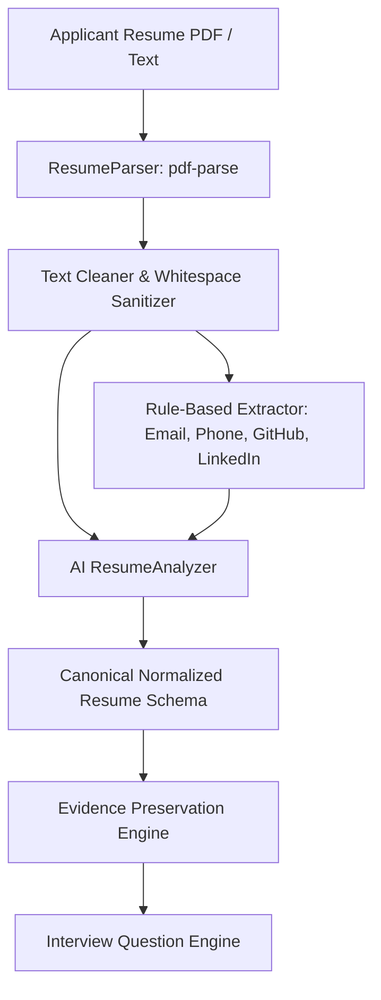

# Applicant Resume Intelligence & Evidence Preservation Specification

## 1. Overview

The **Resume Intelligence Pipeline** accepts an applicant's uploaded PDF resume, extracts raw text with layout awareness, applies deterministic rule-based extractions, and runs an AI-powered extraction pipeline to produce a **Canonical Normalized Resume**.



---

## 2. Core Evidence Preservation Rules

To guarantee explainability and eliminate AI hallucinations during candidate evaluation:

1. **Extract Only Explicitly Present Information**: The analyzer never fabricates employers, graduation years, job titles, or metrics.
2. **Mandatory Evidence Quotes**: Every skill, project, and work experience entry must include a verbatim quotation from the resume backing the claim.
3. **No Unsubstantiated Proficiency Claims**:
   - If a candidate lists a technology in a comma-separated skills section with no project usage, proficiency is marked as `UNKNOWN` and confidence is limited to `<= 0.7`.
   - Proficiency is only tagged as `INTERMEDIATE`, `ADVANCED`, or `EXPERT` if verifiable project or employment context demonstrates hands-on implementation.
4. **Distinguish Projects from Stated Knowledge**: Skills actively used in concrete projects are labeled `source: "PROJECT"`, providing anchor points for personalized interview questions.
5. **Measurable Achievements**: Quantifiable achievements (e.g. "reduced latency by 45%", "managed cluster of 80 nodes") are extracted into dedicated arrays.

---

## 3. Canonical Normalized Resume Schema

```json
{
  "profile": {
    "name": "Alex Rivera",
    "email": "alex.rivera@example.com",
    "phone": "+1-555-0199",
    "location": "San Francisco, CA",
    "links": [
      "https://github.com/alexrivera",
      "https://linkedin.com/in/alexrivera"
    ]
  },
  "summary": "Full-stack software engineer with 4 years of experience building distributed backend services and real-time web applications.",
  "education": [
    {
      "degree": "Bachelor of Science",
      "major": "Computer Science",
      "institution": "University of California, Berkeley",
      "graduationYear": "2021",
      "gpa": "3.8",
      "honors": ["Honors in Computer Science"],
      "evidence": "B.S. in Computer Science, UC Berkeley, 2021, GPA: 3.8"
    }
  ],
  "experience": [
    {
      "company": "CloudScale Systems",
      "role": "Backend Engineer",
      "location": "San Francisco, CA",
      "duration": "2022 - Present",
      "current": true,
      "highlights": [
        "Architected payment reconciliation service handling 100k daily transactions",
        "Optimized PostgreSQL queries reducing peak P99 latency from 450ms to 45ms"
      ],
      "technologies": ["Node.js", "TypeScript", "PostgreSQL", "Redis", "Docker"],
      "measurableAchievements": [
        "Reduced peak P99 latency from 450ms to 45ms"
      ],
      "evidence": [
        "Architected payment reconciliation service handling 100k daily transactions",
        "Optimized PostgreSQL queries reducing peak P99 latency from 450ms to 45ms"
      ]
    }
  ],
  "skills": [
    {
      "name": "PostgreSQL",
      "category": "DATABASE",
      "proficiency": "INTERMEDIATE",
      "evidence": [
        "Optimized PostgreSQL queries reducing peak P99 latency from 450ms to 45ms"
      ],
      "source": "EXPERIENCE",
      "confidence": 0.96
    },
    {
      "name": "Redis",
      "category": "DATABASE",
      "proficiency": "UNKNOWN",
      "evidence": [
        "Listed under database tools in technical skills"
      ],
      "source": "SKILLS_SECTION",
      "confidence": 0.7
    }
  ],
  "projects": [
    {
      "name": "Distributed Order Engine",
      "description": "High-throughput ordering backend for retail storefronts",
      "role": "Sole Developer",
      "technologies": ["Node.js", "TypeScript", "Redis", "Docker"],
      "highlights": [
        "Implemented cache-aside strategy with Redis"
      ],
      "measurableAchievements": [],
      "liveUrl": "https://github.com/alexrivera/order-engine",
      "evidence": [
        "Built distributed order engine using Node.js and Redis caching"
      ]
    }
  ],
  "certifications": [],
  "achievements": [
    {
      "title": "Latency Optimization Award",
      "description": "Recognized for optimizing database queries across 4 microservices",
      "measurableImpact": "450ms -> 45ms"
    }
  ],
  "technologies": [
    "Node.js", "TypeScript", "PostgreSQL", "Redis", "Docker", "Git"
  ],
  "domains": [
    {
      "name": "FinTech / Payments",
      "evidence": "Architected payment reconciliation service handling 100k daily transactions"
    }
  ]
}
```

---

## 4. Integration with Interview Question Engine

The normalized resume serves as the **personalization bedrock** for interview generation:
- The **Job Description** defines *what to test*.
- The **Normalized Resume** supplies the candidate's actual projects, technologies, and achievements, enabling the AI to craft questions directly referencing their demonstrated work.
