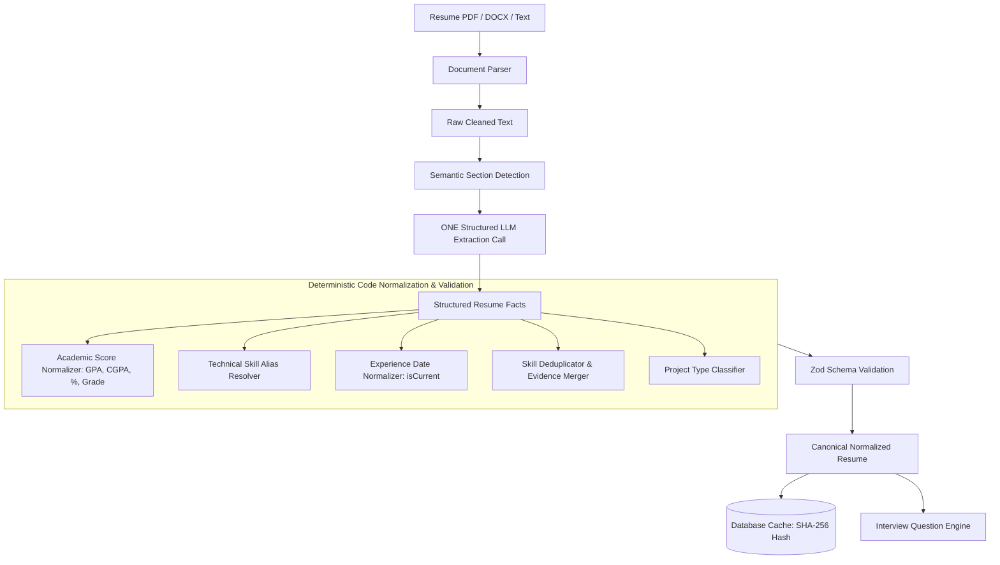

# Smart Resume Intelligence Pipeline — CS Interview Platform

> 📖 **Related Overview Document**: [Applicant Resume Intelligence & Evidence Preservation Specification](./resume-analysis.md)

## 1. Overall Architecture

The Smart Resume Understanding Pipeline is specifically engineered for **Computer Science and Software Engineering interviews** (Software Engineer, Backend, Frontend, Full Stack, AI/ML, Data Engineer, DevOps/Cloud, SRE, Mobile, Security, QA/Automation, and CS Internship roles).

The architecture enforces a strict separation of concerns across three distinct layers:



### Core Axiom:
```text
PARSER = extracts text
LLM = understands semantic meaning
CODE = normalizes + validates + deduplicates
```

---

## 2. Parser Responsibility

The document parser (`ResumeParser`) is strictly responsible for document format handling, layout sanitization, and text extraction from:
- **PDF documents** (using `pdf-parse`)
- **DOCX Word documents** (using `mammoth`)
- **Plain text strings**

It preserves:
- Raw text and line structure
- Section headings and subheadings
- Bullet points and lists
- Page boundaries and breaks
- URLs (GitHub, LinkedIn, portfolios)
- Contact information (Email, Phone)
- Exact dates and original candidate wording

**What the parser does NOT do:**
The parser is never responsible for semantic interpretation (e.g. determining whether `CGPA` is an academic score or whether `NodeJS` is `Node.js`). That responsibility belongs to the LLM and normalization layers.

---

## 3. ONE Structured LLM Call

To maintain strict cost control, low latency, and deterministic reliability, the pipeline uses **exactly ONE primary structured LLM extraction call**.

The system does **NOT** make separate LLM calls for education, skills, experience, projects, achievements, GPA parsing, or skill aliases.

The single call receives the complete sanitized resume text along with detected section headers and extracts:
- **Profile**: Name, email, phone, location, LinkedIn, GitHub, portfolio, links
- **Summary**: Stated professional executive summary
- **Education**: Degree, major, institution, graduation dates, raw academic scores, honors
- **Experience**: Companies, roles, durations, current status, responsibilities, technologies, achievements
- **Skills**: Technical competencies with category, source, confidence, and verbatim evidence quotes
- **Projects**: Name, description, candidate role, technologies, highlights, measurable metrics, project type, URLs
- **Certifications & Achievements**: Credential IDs, issuers, awards, competitions
- **CS Fundamentals & Domains**: Data structures, algorithms, system design, databases, networking, cloud

---

## 4. Deterministic Normalization

Post-extraction processing is handled deterministically in code via `ResumeNormalizer`:
- Eliminates AI hallucinations during data formatting.
- Guarantees 100% testable, predictable behavior.
- Strictly adheres to the rule: **Never lose information during normalization**.

For every important entity, the system preserves:
```text
canonical value + original value + aliases + raw text + evidence
```

---

## 5. GPA / CGPA Semantic Understanding

The academic score normalizer (`ResumeNormalizer.normalizeAcademicScore`) handles all standard notations without making assumptions or performing arbitrary conversions:

### Formats Recognized:
- **CGPA**: `CGPA: 8.1`, `8.2/10`, `C.G.P.A.: 9.2`, `Cumulative GPA: 8.5`
- **GPA**: `GPA: 3.7/4.0`, `GPA: 3.8`, `G.P.A.: 3.9`, `Grade Point Average: 3.5`
- **Percentage**: `82%`, `88.5 %`, `Percentage: 85%` (scale: 100)
- **Letter Grades**: `Final Grade: A+`, `Grade: A`, `Grade B+`
- **Marks / Score**: `Marks: 450/500`, `Score: 88`

### Critical Rules:
1. **Preserve Original Wording**: The candidate's exact raw score string is retained in `academicScore.raw`.
2. **Do Not Invent Scales**: If the resume states `CGPA: 8.1`, `scale` is `null`. The system **never** assumes `/10` unless explicitly written (`8.1/10`).
3. **Do Not Assume GPA is Out of 4**: If stated as `GPA: 3.7`, `scale` is `null` unless written as `3.7/4.0`.
4. **No Arbitrary Conversions**: The system never converts GPA/CGPA to percentage (e.g. multiplying by 9.5) or percentage to GPA.
5. **Enforce Non-Equivalence**: `GPA` ≠ `CGPA`. Both represent distinct institutional scoring methodologies.

---

## 6. Technical Skill Aliases

The system maintains a deterministic alias resolution table for Computer Science and Software Engineering technologies:

| Raw Alias | Canonical Name | Category |
|---|---|---|
| `NodeJS`, `Node JS`, `Node`, `Node.js` | `Node.js` | `BACKEND` |
| `JS`, `Javascript`, `Java Script` | `JavaScript` | `LANGUAGES` |
| `TS`, `Typescript`, `Type Script` | `TypeScript` | `LANGUAGES` |
| `ReactJS`, `React.js`, `React JS`, `React` | `React` | `FRONTEND` |
| `Postgres`, `Postgre SQL`, `PostgreSQL` | `PostgreSQL` | `DATABASES` |
| `Mongo`, `Mongo DB`, `MongoDB` | `MongoDB` | `DATABASES` |
| `K8s`, `Kubernetes` | `Kubernetes` | `CLOUD_DEVOPS` |
| `Golang`, `Go language` | `Go` | `LANGUAGES` |
| `Python3`, `Python 3` | `Python` | `LANGUAGES` |
| `AWS`, `Amazon Web Services` | `AWS` | `CLOUD_DEVOPS` |
| `GCP`, `Google Cloud Platform` | `GCP` | `CLOUD_DEVOPS` |
| `Docker` | `Docker` | `CLOUD_DEVOPS` |
| `Kafka`, `Apache Kafka` | `Apache Kafka` | `BACKEND` |
| `Tailwind`, `TailwindCSS` | `Tailwind CSS` | `FRONTEND` |

### Strict Non-Equivalence:
- `Java` ≠ `JavaScript`
- `React` ≠ `React Native`
- `C` ≠ `C++` ≠ `C#`

---

## 7. Evidence Model & Confidence

Every technical claim is validated against verbatim text from the resume:
- `EvidenceTypeEnum`:
  - `EXPLICIT`: Directly quoted text from experience, projects, or education.
  - `INFERRED`: Derived from verifiable surrounding context.
  - `CALCULATED`: Quantified metric or duration.
- `Confidence`: Number between `0.0` and `1.0`.
  - Stated in skills list only: confidence `<= 0.7`, `proficiency: "UNKNOWN"`.
  - Implemented in project or work history: confidence `>= 0.9`, verified evidence quote attached.

---

## 8. Experience Date Normalization

Experience timelines are standardized into `DateRange`:
- **Active Employment Equivalents**: Keywords such as `Present`, `Current`, `Till date`, `Till now`, `Ongoing`, and `Current role` automatically set `isCurrent: true` and `endDate: "Present"`.
- **Formats Handled**: `Jan 2023 - Present`, `2023 - 2024`, `06/2023 - Present`, `Summer 2024`.

---

## 9. Deduplication & Merging

When multiple equivalent skills are extracted across different sections (e.g. `NodeJS` from skills, `Node.js` from work experience, and `Node JS` from a project):
1. Collapses into **ONE canonical entry** (`Node.js`).
2. Merges all aliases: `["NodeJS", "Node.js", "Node JS"]`.
3. Merges all evidence quotes without duplication.
4. Promotes source to the highest-priority tier: `PROJECT` > `EXPERIENCE` > `CERTIFICATION` > `EDUCATION` > `SKILLS_SECTION`.
5. Retains the highest verified confidence score.

---

## 10. Project Classification

Projects are classified into structured categories based on contextual evidence:
- `PERSONAL`: Side projects, hobby implementations, independent portfolio apps.
- `ACADEMIC`: Coursework, university assignments, capstone projects, thesis.
- `PROFESSIONAL`: Internal tools, enterprise applications, production deployments.
- `OPEN_SOURCE`: Community libraries, public GitHub repositories with contributions.
- `RESEARCH`: IEEE papers, arXiv publications, experimental benchmarks.
- `FREELANCE`: Client projects, contracting work.
- `HACKATHON`: Hackathon submissions, competitive programming builds.
- `UNKNOWN`: Insufficient evidence to classify.

---

## 11. Hallucination Prevention

The system enforces strict anti-hallucination guardrails:
- The LLM is instructed to return `null`, `[]`, `""`, or `UNKNOWN` whenever a field is not present.
- Unsupported technologies, companies, dates, or metrics are never added.
- The pipeline explicitly prefers missing information over hallucinated information.

---

## 12. Caching & LLM Cost Strategy

To minimize AI costs:
1. **Content Checksum**: A SHA-256 hash is computed on the extracted resume text.
2. **Analysis Versioning**: Stored under `analysisVersion: "v3"`.
3. **Zero-LLM Fast Path**: If an identical resume hash and version exists for the applicant, the stored canonical analysis is returned immediately without executing any LLM call.

---

## 13. Testing Suite

Automated test suites cover:
- **Academic Score Normalization**: GPA, CGPA, Percentage, Marks, Grades, explicit vs unstated scales, non-equivalence (`GPA` ≠ `CGPA`), no conversion assumptions.
- **Skill Alias Resolution**: Known alias mapping, preserving raw text, enforcing non-equivalence (`Java` ≠ `JavaScript`, `React` ≠ `React Native`).
- **Deduplication**: Collapsing multiple alias instances into one canonical entity with merged aliases and evidence.
- **Date Range Parsing**: `Present`, `Current`, `Till date`, `Ongoing`.
- **Project Classification**: Hackathon, academic, open source, research, freelance, personal.
- **Section Detection**: Variant header recognition.
- **Schema Validation**: 100% Zod validation pass.
