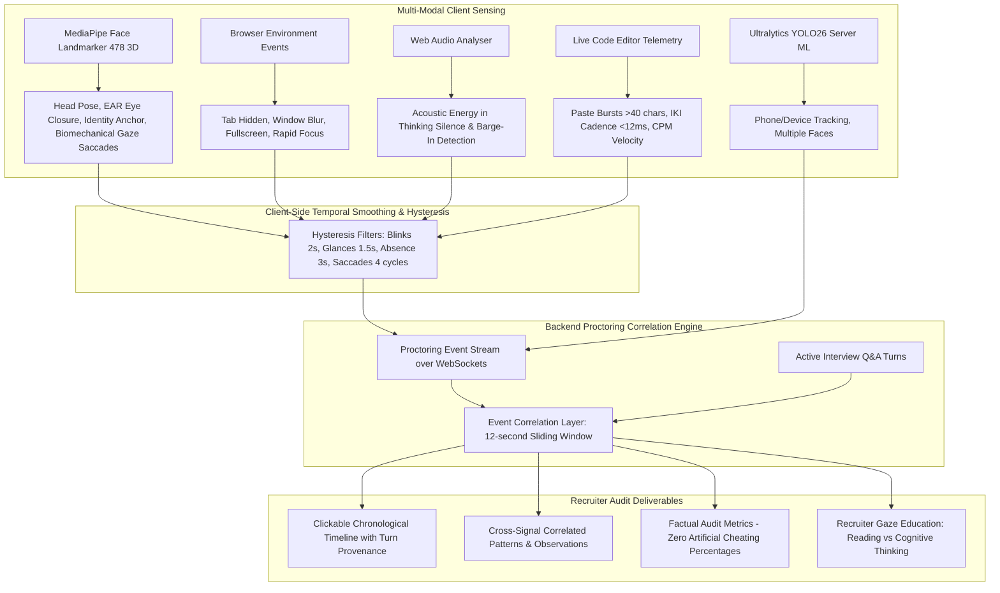

# Multi-Signal Evidence-Based Smart Proctoring & Telemetry System

## 1. System Overview

The **Multi-Signal Evidence-Based Smart Proctoring & Telemetry System** elevates candidate assessment from brittle binary cheating flags to an objective, multi-modal evidence and audit layer.

The platform correlates real-time vision, geometric facial landmarks, acoustic activity, keystroke cadence, and browser environment state against specific interview Q&A turns, producing a chronological **Proctoring Evidence Timeline**, **Factual Proctoring Summary**, and **Recruiter Audit Guide**.



---

## 2. Core Non-Punitive Evidence Principles

1. **Evidence, Not Automatic Disqualification**:
   - Proctoring events are recorded as neutral, objective evidence for human recruiter review.
   - The system **never** automatically terminates an interview or labels a candidate as fraudulent based on algorithmic scores.
2. **Zero Deceptive Probabilities**:
   - The platform strictly rejects deceptive scores such as *"Cheating probability: 89%"*. Detection confidence measures model certainty ($P(\text{object} \mid \text{pixels})$), **never candidate dishonesty**.
3. **Accessibility & Neurodiversity Protection**:
   - Cheating is never inferred solely from gaze direction, head movement, neurodiverse speaking cadences, or accessibility tools.
4. **Strict Temporal Hysteresis**:
   - Natural human blinks (100–300ms) or momentary thinking glances (0.4s) never trigger alerts. Thresholds require sustained presence ($\text{EAR} < 0.16 \ge 2.0\text{s}$, head turn $\ge 1.5\text{s}$).
5. **Zero OS Snooping**:
   - The system operates strictly within standard browser security sandbox APIs. It does not attempt to read Windows Task Manager, inspect private OS processes, or scan local files.

---

## 3. Sensing Modalities & Thresholds

| **MediaPipe / YOLO** | **Candidate Absence** | 478 3D facial landmarks & YOLO26 face detector | $\ge 1.0\text{s}$ absence (`FACE_LOST_FRAMES = 1`, $\Delta t \ge 1000\text{ms}$) | `ABSENT_USER` | +2 (Immediate Snapshot) |
| **MediaPipe** | **Prolonged Absence** | Landmark tracker persistence buffer | $\ge 3.0\text{s}$ continuous loss | `FACE_MISSING` | +1 |
| **MediaPipe** | **Head Pose** | Geometric angles: Nose (#1), Chin (#152), Eye corners (#33, #263) | $\|\text{yaw}\| > 25^\circ$, sustained $\ge 1.5\text{s}$ | `HEAD_TURN` | Info |
| **MediaPipe** | **Eye Closure** | Eye Aspect Ratio (EAR) across 12 eyelid landmarks | $\text{EAR} < 0.16$, sustained $\ge 2.0\text{s}$ | `EYES_CLOSED` | Info |
| **MediaPipe** | **Gaze Away** | Iris landmark vectors (#468, #473) relative to eye corners | Off-screen vectors sustained $\ge 1.8\text{s}$ | `GAZE_AWAY` | Info |
| **MediaPipe** | **Reading Saccades** | Rhythmic horizontal gaze sweeps with carriage returns | $\ge 3$ consecutive sweeps across 3 lines | `OFF_SCREEN_READING` | +1 |
| **MediaPipe** | **Down Gaze** | Sustained downward gaze vectors ($y > 0.65$) | Downward dwell $\ge 3.5\text{s}$ | `CONCEALED_PHONE_GAZE` | +2 |
| **MediaPipe** | **Identity Anchor** | Facial landmark geometric ratios ($R_1 = \text{eye}/\text{chin}$, $R_2 = \text{mouth}/\text{eye}$) | $> 38\%$ variance sustained $\ge 3.0\text{s}$ | `FACE_IDENTITY_CHANGE` | +2 |
| **Camera Feed** | **Obstruction** | 16x16 canvas downsampled luminance sampling | Mean luminance $< 10/255 \ge 2.5\text{s}$ | `CAMERA_OBSTRUCTED` | +1 |
| **Browser API** | **Tab Visibility** | `document.visibilityState` / `visibilitychange` | Hidden $\ge 600\text{ms}$ | `TAB_HIDDEN` | +1 |
| **Browser API** | **Window Focus** | `window.onblur` / `window.onfocus` | Blur $\ge 1000\text{ms}$ | `WINDOW_BLUR` | +1 |
| **Browser API** | **Rapid Focus** | Frequency of window blur events | $\ge 3$ blur events in $12\text{s}$ | `RAPID_FOCUS_CHANGE` | +1 |
| **Browser API** | **Fullscreen Exit**| `document.fullscreenchange` | Exited active fullscreen | `FULLSCREEN_EXIT` | +1 |
| **Code Editor** | **Paste Burst** | `textarea.onPaste` character & line analysis | $>40$ chars or $\ge 3$ lines injected $<200\text{ms}$ | `CODE_PASTE_BURST` | +2 |
| **Code Editor** | **Macro Cadence**| Inter-Keystroke Interval (IKI) buffer | Sustained $\text{avg IKI} < 12\text{ms}$ ($N \ge 15$) | `UNNATURAL_KEYSTROKE_CADENCE` | +1 |
| **Web Audio API**| **Silence Spikes** | AnalyserNode frequency & RMS energy | RMS $> 0.16$ sustained $\ge 1.2\text{s}$ in silence | `AUDIO_ANOMALY` | +1 |
| **Web Audio API**| **Barge-In Voice** | AnalyserNode voice volume during AI speech | RMS $> 0.05$ sustained $\ge 150\text{ms}$ during playback | `BARGE_IN` | 0 (Feature) |
| **YOLO26 Server**| **Secondary Devices**| Ultralytics YOLO26 server-side inference | Confidence $> 0.65$, tracked tracks | `UNAUTHORIZED_DEVICE` | +2 |
| **YOLO26 Server**| **Multiple Faces** | Ultralytics YOLO26 face detector | $\ge 2$ distinct faces in frame | `MULTIPLE_FACES` | +2 |

---

## 4. Keystroke & Paste Velocity Telemetry

Modern AI candidates frequently attempt to inject ChatGPT-generated solutions into coding challenges. The platform instruments the code editor with two non-invasive telemetry monitors:

### 1. Copy-Paste Burst Detection (`CODE_PASTE_BURST`)
- **Mechanism**: The editor attaches an `onPaste` event handler analyzing clipboard text length and line count.
- **Threshold**: Injections of $>40$ characters or $\ge 3$ lines of code appearing in a single event are flagged as an instantaneous burst.
- **Action**:
  1. Captures a 320x240 webcam snapshot showing the candidate at the exact moment of paste injection.
  2. Emits `trigger_violation` with event type `CODE_PASTE_BURST`, payload metadata, and photographic proof.
  3. Increments the session misconduct count by 2 points.
  4. Surfaces in the recruiter report as a high-severity review cluster.

### 2. Inter-Keystroke Interval & Macro Cadence (`UNNATURAL_KEYSTROKE_CADENCE`)
- **Mechanism**: Buffers the timestamps of the last 25 keystrokes on `onKeyDown` and computes the rolling Inter-Keystroke Interval:
  $$\text{IKI}_{\text{avg}} = \frac{1}{N - 1} \sum_{i=1}^{N-1} (t_i - t_{i-1})$$
- **Live Typing Velocity**: Computes Characters Per Minute ($\text{CPM} = \frac{N}{\Delta t_{\text{min}}}$).
- **Macro Threshold**: Human physical limits cannot sustain typing intervals $< 12\text{ms}$ across multiple keys. When $\text{IKI}_{\text{avg}} < 12\text{ms}$ for $N \ge 15$, the system flags synthetic/automated macro typing.

---

## 5. Natural Interruption Handling (Barge-In)

Traditional voice interview bots suffer from awkward audio collisions when a candidate interrupts the bot while it is speaking. 

The platform implements **Barge-In Voice Sensitivity**:
1. **Acoustic Monitoring**: When `kokoroTTS.isPlaying` is `true`, a browser-side Web Audio `AnalyserNode` (`fftSize: 512`) samples root-mean-square (RMS) microphone volume:
   $$\text{RMS} = \sqrt{\frac{1}{M} \sum_{k=0}^{M-1} x[k]^2}$$
2. **Sensitivity Threshold**: If $\text{RMS} > 0.05$ is sustained for $\ge 150\text{ms}$ (preventing mouse clicks or desk taps from falsely triggering), Barge-In fires immediately.
3. **Execution**:
   - Calls `kokoroTTS.stopAudio()` to instantly mute the AI speech synthesis.
   - Emits `barge_in` over WebSocket to notify backend session state.
   - Displays an animated `Candidate Interrupted (Barge-In Active)` indicator in the header.
   - Hands over control seamlessly to candidate response recording without awkward overlap.

---

## 6. Biomechanical Gaze Analysis & Recruiter Education

To prevent recruiters from mistaking normal human cognitive processing for cheating, the system analyzes eye movements and equips recruiters with an educational guide:

### Reading vs. Thinking Discrepancy

```text
┌────────────────────────────────────────────────────────┐
│               HOW TO READ CANDIDATE GAZE               │
├───────────────────────────┬────────────────────────────┤
│   READING AN EXTERNAL SCRIPT  │   NATURAL COGNITIVE THINKING │
├───────────────────────────┼────────────────────────────┤
│ • Strict horizontal sweep │ • Upward or corner drift   │
│ • Rhythmic line returns   │ • Long static fixations    │
│ • Uniform saccade speed   │ • Variable interval timing │
│ • Sustained downward dwell│ • Blinking & eye closure   │
│ • Frequent identical loops│ • Gaze breaks during speech│
└───────────────────────────┴────────────────────────────┘
```

### Evaluated Gaze Patterns
1. **Horizontal Reading Saccades (`OFF_SCREEN_READING`)**:
   - Biomechanics: Left-to-right eye saccades followed by rapid regression carriage return.
   - Meaning: Candidate is actively reading structured off-screen lines of text.
2. **Concealed Downward Dwell (`CONCEALED_PHONE_GAZE`)**:
   - Biomechanics: Sustained downward pitch ($y > 0.65$) for $>3.5\text{s}$ while face remains facing the screen.
   - Meaning: Looking down at a phone resting on the desk or lap.
3. **Repeated Corner Glances (`SUSPICIOUS_CORNER_GLANCES`)**:
   - Biomechanics: High-frequency peripheral glances ($>5$ in $15\text{s}$) to a secondary display or assistant.
4. **Natural Cognitive Divergence (`NATURAL_COGNITIVE_DIVERGENCE`)**:
   - Biomechanics: Upward or lateral gaze shifts during the initial 3 seconds of a question.
   - Meaning: **Completely normal human cognitive recall**. Recruiter action: **DO NOT PENALIZE**.

---

## 7. Fullscreen & Clean-Screen Exam Integrity

Before beginning the interview, candidates are presented with a strict exam setup modal enforcing:
- **Automatic Viewport Fullscreen**: Hides OS desktop taskbars, secondary browser tabs, and notification trays.
- **Tab & Window Cleanliness**: Instructions prompting candidates to close background browser tabs, communication apps (Slack, Discord), and screen sharing overlays.
- **Live Re-entry Enforcement**: If the candidate exits fullscreen during the session, a `FULLSCREEN_EXIT` violation is logged with a snapshot, and a re-enable prompt is shown.

---

## 8. Candidate Absence Telemetry & Instant Snapshot Storage (`ABSENT_USER`)

To ensure candidates remain present throughout the evaluation without leaving the camera to consult external devices or secondary assistants:

```mermaid
flowchart TD
    FRAME[Webcam Video Frame] --> DETECT[MediaPipe / YOLO26 Face Detector]
    DETECT --> CHECK{Face In Frame?}
    
    CHECK -->|Yes| RESET[Reset absence timer: consecutiveMissed = 0]
    CHECK -->|No| TRACK[Increment missed frames: consecutiveMissed++]
    
    TRACK --> EVAL_TIME{Absence Duration >= 1.0s?}
    EVAL_TIME -->|No| WAIT[Wait next frame interval]
    EVAL_TIME -->|Yes: FACE_LOST_FRAMES = 1 & dt >= 1000ms| SNAPSHOT[Capture Instant 320x240 Canvas Snapshot]
    
    SNAPSHOT --> WS[Emit trigger_violation over WebSocket]
    WS --> S3[Upload to Private AWS S3: interviews/{sessionId}/screenshot_{seq}.png]
    S3 --> DB[Backend Saves S3 Reference in DetectionEvent: metadata.snapshotKey]
    DB --> TIMELINE[Recruiter Chronological Timeline with Presigned URL Photo Proof]
```

### Protocol Details
1. **Immediate 1.0-Second Absence Threshold**:
   - Monitored continuously at 10 FPS.
   - If the candidate's face is absent for even **1.0 second** (`FACE_LOST_FRAMES = 1`, `FACE_ABSENCE_THRESHOLD_MS = 1000`), the departure is flagged immediately.
2. **Instant Photographic Snapshot Evidence**:
   - The frontend instantly grabs the current video frame from the video element and downsamples it onto a hidden 320x240 HTML5 canvas.
   - The snapshot is encoded as a compact JPEG data URL (`image/jpeg`, 0.7 quality).
3. **Real-Time Event Dispatch & Storage**:
   - Emits `trigger_violation` over Socket.IO with payload:
     ```json
     {
       "type": "ABSENT_USER",
       "message": "Candidate moved out of camera frame",
       "points": 1,
       "snapshotBase64": "data:image/jpeg;base64,...",
       "metadata": { "durationMs": 1024 }
     }
     ```
   - The backend `SocketHandler` streams the snapshot buffer directly to AWS S3 (`S3Service.uploadScreenshot`) and records the structured event with `metadata.snapshotKey` in the `DetectionEvent` table.
4. **Recruiter Audit Review**:
   - Surfaces in Candidate Analysis (`/admin`) and the Explainable Report Modal.
   - Displays exact second-by-second timestamps and clickable photo proof thumbnails, allowing human recruiters to quickly verify if the candidate stood up, ducked under the desk, or briefly stepped away.

---

## 7. Private Cloud Storage Architecture, 100-Image Threshold Cap & Click-to-View Inspection

### Storage Architecture & Threshold Controls
- **Private Storage Bucket**: Private S3 bucket configured via `AWS_S3_BUCKET` (e.g. Region `ap-south-1`).
- **Object Key Isolation**:
  `interviews/{interviewId}/screenshot_{sequenceNumber}.png`
  Zero-padded to 3 digits (`screenshot_001.png`, `screenshot_002.png`, etc.).
- **Concurrency Safety & 100-Image Threshold Cap**:
  Atomic mutex per session (`getNextSequenceNumber`) guarantees sequential, non-colliding numbering. Enforces a **hard cap of maximum 100 images per interview session** (`MAX_IMAGES_PER_INTERVIEW = 100`) to prevent cloud storage bloat and denial-of-wallet risks.
- **Dynamic Presigned URL Auto-Resigning**:
  Regex key extraction `(interviews/[^/?]+/screenshot_\d+\.png)` dynamically auto-refreshes short-lived presigned GET URLs for telemetry events and timeline items.
- **Zero Database Bloat**:
  Webcam snapshots are stored as binary PNG objects in cloud storage; PostgreSQL only retains the lightweight object key reference (`snapshotKey`).
- **Clean Non-Technical Enterprise Terminology**:
  UI displays clean, professional terminology (**"Photographic Evidence"**, **"Photo Captures"**, **"Verified Evidence"**, **"Ref ID"**) instead of exposing internal cloud infrastructure names.

### Recruiter Click-to-View Evidence Modal
In `/admin` (Candidate Analysis) & `/evaluation`:
- Proctoring cards for **Camera Departure**, **Mobile Devices**, **Downward Gaze**, **Tab Switches**, **Answer Integrity**, and **Code Paste Bursts** display interactive `View Photo Evidence 📷` badges when events exist.
- Clicking any card opens a high-resolution evidence modal featuring:
  - Violation title & description
  - Verification badge: `Verified Evidence`
  - Reference ID (`Ref ID: screenshot_001.png`)
  - Capture timestamp
  - Centered high-resolution image fetched securely via presigned URLs
  - Multi-snapshot navigation controls (`<` and `>`) to cycle through all captures


